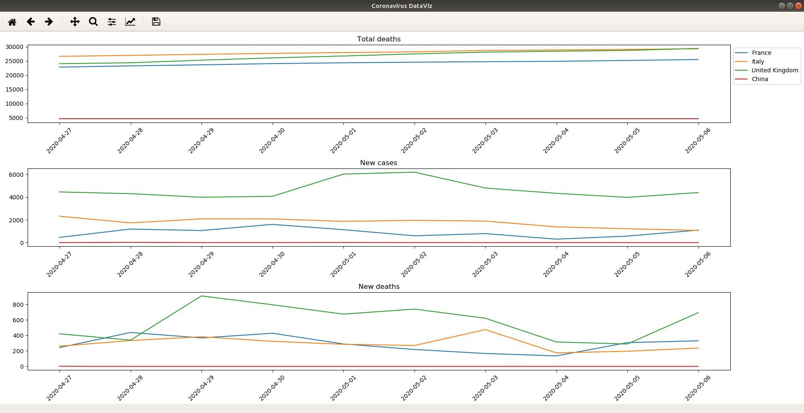

# coronavirus_plotting

/!\ THIS PROJECT IS STILL IN PROGRESS /!\

A small data visualization project on the spread of coronavirus getting data from https://ourworldindata.org/coronavirus-source-data.

Currently using matplotlib, a Python library.

